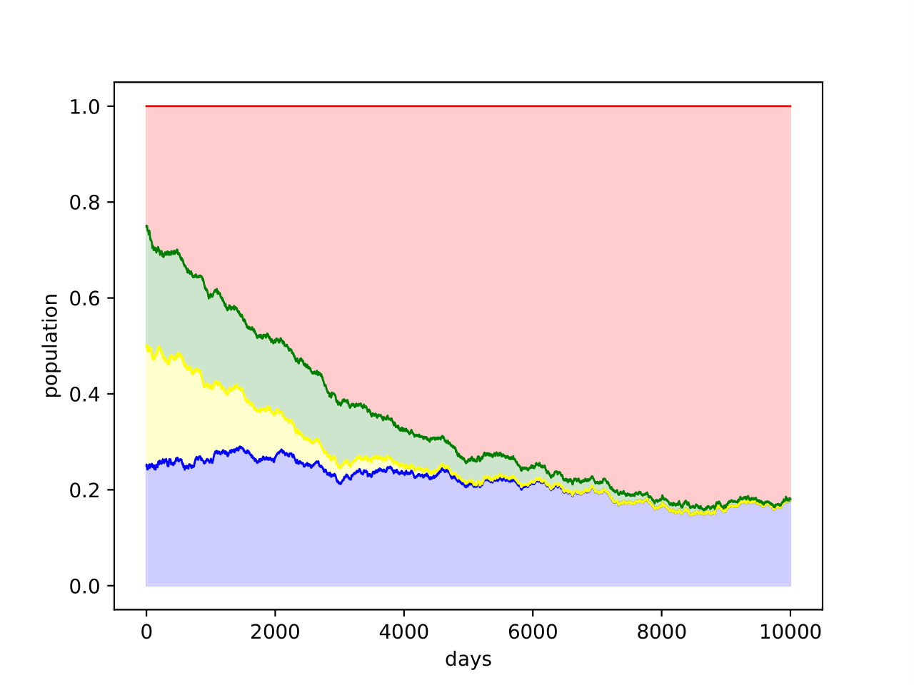
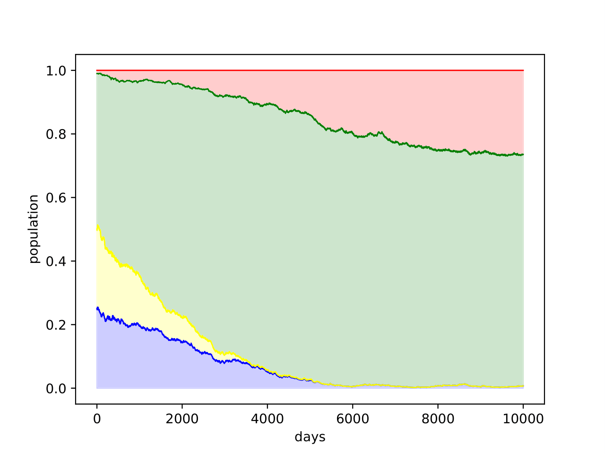

# AltruismSimulator

To reproduce our results you first need to clone our repository and afterwards install the dependencies.

    pip install -r requirements.txt

Following that, you can run the following script which will place our plots in `report/figures/archive/`.

    bash run_experiments.sh

This will create plots such as the following.

To try out other parameters, feel free to change some of the settings in the `core/experiments/` directory. To e.g.
change the amount of impostors in the last experiment change the population types in `core/experiments/exp4_impostor.py` to the following.

    cfg.POP_TYPES = {0: 0.25,
                     1: 0.25,
                     2: 0.49,
                     3: 0.01}

    